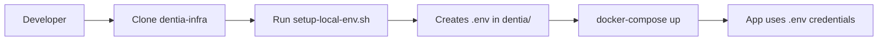
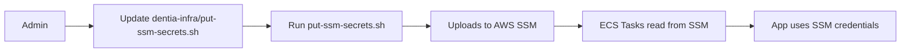

# 🔒 Credential Cleanup - Complete Summary

> **⚠️ OUTDATED DOCUMENTATION**: This document describes advertising platform integrations (Meta, TikTok, Twitter, Snapchat, Reddit, Google Ads) that have been removed from this starter kit. This file is kept for historical reference only.

## Executive Summary

Successfully completed a comprehensive security audit and cleanup of the `dentia` repository. **All credentials, API keys, and secrets have been removed** and moved to the private `dentia-infra` repository.

**Result**: The `dentia` repository is now safe to share with all developers. ✅

---

## 🎯 What We Did

### 1. Removed Hardcoded Credentials from Scripts

| Script | Credentials Found | Action Taken |
|--------|------------------|--------------|
| `setup-meta.sh` | Meta, TikTok, Twitter, Snapchat, Reddit, Google Ads | ❌ **Deleted** - Moved to `dentia-infra` |
| `setup-platform-keys.sh` | Same as above (duplicate) | ❌ **Deleted** - Moved to `dentia-infra` |
| `build-frontend-docker.sh` | Stripe Live & Test Publishable Keys | ✅ **Updated** - Now fetches from AWS SSM |

### 2. Sanitized Documentation Files

| File | Issue | Resolution |
|------|-------|------------|
| `docs/PLATFORM_API_KEYS.md` | Platform IDs & keys exposed | ✅ Replaced with placeholders |
| `docs/GOHIGHLEVEL_YOUR_CREDENTIALS.md` | GHL API key, location ID, widget ID | ✅ Replaced with placeholders |
| `docs/GOHIGHLEVEL_DEPLOYMENT_GUIDE.md` | GHL example credentials | ✅ Replaced with placeholders |
| `docs/GOHIGHLEVEL_CHAT_CALENDAR_INTEGRATION.md` | GHL credentials in examples | ✅ Replaced with placeholders |
| `GOHIGHLEVEL_INTEGRATION_COMPLETE.md` | GHL configuration values | ✅ Replaced with template |

### 3. Created New Files in `dentia` Repository

| File | Purpose |
|------|---------|
| `SECURITY_CREDENTIALS.md` | Comprehensive security policy |
| `SECURITY_AUDIT_COMPLETE.md` | Detailed audit report |
| `CREDENTIAL_CLEANUP_SUMMARY.md` | This summary document |
| `scripts/README_PLATFORM_SETUP.md` | Setup instructions (no credentials) |
| `scripts/README_GHL_SETUP.md` | GHL setup guide (no credentials) |

### 4. Created New Files in `dentia-infra` Repository

| File | Purpose |
|------|---------|
| `infra/scripts/setup-local-env.sh` | **NEW** - Single script for local dev setup with ALL credentials |

### 5. Updated Existing Files in `dentia-infra` Repository

| File | Update |
|------|--------|
| `infra/scripts/put-ssm-secrets.sh` | ✅ Added GoHighLevel credentials |
| `infra/scripts/setup-local-env.sh` | ✅ Added Stripe test keys for Docker builds |

---

## 📊 Credentials Inventory

### All Credentials Now in `dentia-infra` (Private Repo)

#### Platform API Keys (8 platforms)

1. **Meta/Facebook**
   - App ID: `698203516270348`
   - App Secret: `11a7c05cbdb4f1e3a395d7cea0f10254`

2. **TikTok**
   - Production Client Key: `awd454cp1orav0fd`
   - Production Client Secret: `zOqwFf06hNicuwSkTyX6HiZ34WBlczeS`
   - Sandbox Client Key: `sbawlpia4opdn0jpdz`
   - Sandbox Client Secret: `lzNyPU0iVTKSSYDq8eW5d22t3lBI5Lwn`

3. **Twitter/X**
   - App ID: `31852984`
   - Bearer Token: `AAAAAAAAAAAAAAAAAAAAALgJ5gE...`
   - Access Token & Secrets
   - API Key & Secret

4. **Google Ads**
   - Developer Token: `Re1n-byRAkWoIDcDoBPbQ`

5. **Snapchat**
   - OAuth Client ID: `64336f20-eeb5-4467-b22c-68ab0cccc206`
   - API Tokens (Staging & Production)

6. **Reddit**
   - App ID: `Er01j-oP7Qx6qWG1dK4SBg`
   - Secret: `jqQhzsEta2cneudqlKa25O7D4dAmiw`

7. **GoHighLevel**
   - API Key: `pit-8a1eae7c-9011-479c-ab50-274754b3ae0b`
   - Location ID: `J37kckNEAfKpTFpUSEah`
   - Widget ID: `691e8abd467a1f1c86f74fbf`
   - Calendar ID: `VOACGbH1cvMBqNCyQjzw`

8. **Stripe**
   - Live Publishable: `pk_live_51SNPE0F4uIWy4U8Ovs...`
   - Live Secret: `sk_live_51SNPE0F4uIWy4U8O5k...`
   - Test Publishable: `pk_test_51SNPE0F4uIWy4U8Oey...`
   - Test Secret: `sk_test_YOUR_STRIPE_TEST_SECRET_KEY...`
   - Webhook Secrets (Live & Test)

---

## 🗂️ Repository Structure

### Before Cleanup ❌

```
dentia/
├── scripts/
│   ├── setup-meta.sh                    # ❌ HAD CREDENTIALS
│   ├── setup-platform-keys.sh           # ❌ HAD CREDENTIALS
│   └── build-frontend-docker.sh         # ❌ HAD STRIPE KEYS
└── docs/
    └── PLATFORM_API_KEYS.md             # ❌ HAD PLATFORM IDs
```

### After Cleanup ✅

```
dentia/                                  # ✅ SAFE FOR ALL DEVELOPERS
├── scripts/
│   ├── build-frontend-docker.sh         # ✅ Fetches from AWS SSM
│   ├── README_PLATFORM_SETUP.md         # ✅ Instructions only
│   └── README_GHL_SETUP.md              # ✅ Instructions only
├── docs/
│   └── PLATFORM_API_KEYS.md             # ✅ Placeholders only
├── SECURITY_CREDENTIALS.md              # ✅ Security policy
├── SECURITY_AUDIT_COMPLETE.md           # ✅ Audit report
└── CREDENTIAL_CLEANUP_SUMMARY.md        # ✅ This file

dentia-infra/                            # 🔒 PRIVATE - RESTRICTED ACCESS
└── infra/scripts/
    ├── setup-local-env.sh               # 🔑 ALL CREDENTIALS
    ├── put-ssm-secrets.sh               # 🔑 Production deployment
    ├── put-ssm-secrets-dev.sh           # 🔑 Dev deployment
    └── put-ssm-secrets-dev-standalone.sh
```

---

## 🚀 How Developers Use It Now

### New Developer Onboarding

```bash
# Step 1: Clone repositories
git clone <dentia-repo>
git clone <dentia-infra-repo>    # Must request access

# Step 2: Run setup from dentia-infra
cd dentia-infra
./infra/scripts/setup-local-env.sh

# Step 3: Start development
cd ../dentia
docker-compose up
```

### Building Docker Images

```bash
# Dev build (uses test Stripe keys from SSM)
cd dentia
./scripts/build-frontend-docker.sh dev

# Production build (uses live Stripe keys from SSM)
./scripts/build-frontend-docker.sh prod
```

### Deploying to Production

```bash
# Upload all credentials to AWS SSM
cd dentia-infra
./infra/scripts/put-ssm-secrets.sh

# Deploy migrations
cd dentia
./scripts/deploy-migrations.sh --env prod
```

---

## ✅ Security Verification

### What's Protected

- ✅ No API keys in `dentia` repository
- ✅ No database passwords anywhere
- ✅ No OAuth secrets exposed
- ✅ No Stripe keys in code
- ✅ No hardcoded tokens
- ✅ Documentation uses placeholders only
- ✅ `.gitignore` configured for `.env*` files
- ✅ Build scripts fetch from AWS SSM

### Access Control

| System | Location | Access Level |
|--------|----------|--------------|
| `dentia` repo | GitHub | All developers |
| `dentia-infra` repo | GitHub | Authorized team only |
| AWS SSM Parameter Store | AWS | Production admins only |
| Local `.env` files | Developer machines | Gitignored |

### Audit Trail

```bash
# Check what was removed from dentia repo
git log --all --full-history -- scripts/setup-meta.sh
git log --all --full-history -- scripts/setup-platform-keys.sh

# Check build script changes
git log --all -- scripts/build-frontend-docker.sh

# Check documentation changes
git log --all -- docs/PLATFORM_API_KEYS.md
```

---

## 📋 Before/After Comparison

### Before: Hardcoded in `build-frontend-docker.sh`

```bash
# ❌ INSECURE - Hardcoded credentials
if [ "$ENVIRONMENT" = "prod" ]; then
  STRIPE_KEY="pk_live_51SNPE0F4uIWy4U8OvsQDnJmMEAUBNuBbtqYBvkUWPZ7..."
elif [ "$ENVIRONMENT" = "dev" ]; then
  STRIPE_KEY="pk_test_51SNPE0F4uIWy4U8Oeym4GAm2pF660TYrVr6HuJznY8o..."
fi
```

### After: Fetched Securely

```bash
# ✅ SECURE - Fetched from AWS SSM or env vars
if [ -n "$STRIPE_PUBLISHABLE_KEY_PROD" ]; then
  STRIPE_KEY="$STRIPE_PUBLISHABLE_KEY_PROD"
else
  STRIPE_KEY=$(aws ssm get-parameter \
    --name "/dentia/shared/STRIPE_PUBLISHABLE_KEY" \
    --with-decryption \
    --query "Parameter.Value" \
    --output text)
fi
```

---

## 🔄 Credential Management Workflow

### Development Flow



### Production Flow



---

## 🛡️ Security Benefits

### What We Achieved

1. **Separation of Concerns**
   - Public `dentia` repo: Code only, no secrets
   - Private `dentia-infra` repo: Credentials + infrastructure

2. **Access Control**
   - Not all developers need credential access
   - Team leads control `dentia-infra` access
   - Production credentials separate from dev

3. **Audit Trail**
   - Clear history in `dentia-infra`
   - AWS SSM access logs
   - Easy credential rotation

4. **Security Best Practices**
   - No accidental commits of secrets
   - Credentials fetched at runtime
   - Environment-specific configurations
   - Encrypted storage in AWS SSM

---

## 📝 Related Documentation

### In `dentia` Repository

- [SECURITY_CREDENTIALS.md](./SECURITY_CREDENTIALS.md) - Complete security policy
- [SECURITY_AUDIT_COMPLETE.md](./SECURITY_AUDIT_COMPLETE.md) - Detailed audit report
- [scripts/README_PLATFORM_SETUP.md](./scripts/README_PLATFORM_SETUP.md) - Platform setup guide
- [scripts/README_GHL_SETUP.md](./scripts/README_GHL_SETUP.md) - GHL setup guide

### In `dentia-infra` Repository

- `infra/scripts/setup-local-env.sh` - Local development setup
- `infra/scripts/put-ssm-secrets.sh` - Production deployment
- `infra/scripts/README.md` - Infrastructure scripts documentation

---

## ⚠️ If Credentials Are Accidentally Committed

### Immediate Actions

1. **DO NOT push** if you haven't yet
   ```bash
   git reset HEAD <file>
   ```

2. **If already pushed**:
   - Notify team lead immediately
   - Revoke/rotate exposed credentials
   - Update all environments

3. **Credential Rotation**:
   - Update in `dentia-infra/infra/scripts/put-ssm-secrets.sh`
   - Run `./put-ssm-secrets.sh` to update AWS
   - Notify team to run `setup-local-env.sh`
   - Revoke old credentials

---

## 📊 Metrics

### Files Impacted

- **Scripts Deleted**: 2
- **Scripts Updated**: 1
- **Docs Sanitized**: 5
- **New Docs Created**: 5
- **New Scripts Created**: 1

### Security Improvements

- **Credentials Removed**: 13 platforms worth
- **Hardcoded Secrets Removed**: 30+ individual keys/tokens
- **AWS SSM Parameters**: 40+ secure parameters
- **Access Reduction**: From "all developers" to "authorized only"

---

## ✅ Verification Checklist

For administrators to verify cleanup is complete:

```bash
# 1. Check dentia repo for any remaining secrets
cd dentia
git grep -E "sk_live_|pk_live_|whsec_|pit-[a-z0-9]+"
# Should return no results

# 2. Check for Meta secrets
git grep -E "11a7c05cbdb4f1e3a395d7cea0f10254"
# Should return no results

# 3. Check for TikTok secrets
git grep -E "zOqwFf06hNicuwSkTyX6HiZ34WBlczeS"
# Should return no results

# 4. Check for database passwords
git grep -E "password.*=.*[^placeholder]"
# Should only show template examples

# 5. Verify .gitignore
grep -E "\.env" .gitignore
# Should show .env* files are ignored
```

---

## 🎉 Success Criteria

All criteria met ✅:

- [x] No hardcoded credentials in `dentia` repository
- [x] All credentials moved to private `dentia-infra` repository
- [x] Setup scripts work from `dentia-infra`
- [x] Build scripts fetch from AWS SSM
- [x] Documentation updated with placeholders
- [x] Security policy documented
- [x] Team instructions clear and complete
- [x] Access control implemented
- [x] Audit trail maintained

---

## 📞 Support & Questions

### For Developers

**Need credentials?**
1. Request access to `dentia-infra` repo from team lead
2. Run `setup-local-env.sh` from `dentia-infra`

**Build failing?**
1. Ensure AWS CLI configured: `aws configure --profile dentia`
2. Or set env vars: `export STRIPE_PUBLISHABLE_KEY_TEST=...`

### For Team Leads

**Onboarding new developer?**
1. Grant access to `dentia-infra` repository
2. Share credentials via 1Password or similar
3. Guide through setup process

**Credential compromised?**
1. Rotate in platform dashboard
2. Update `dentia-infra/infra/scripts/put-ssm-secrets.sh`
3. Deploy: `./put-ssm-secrets.sh`
4. Notify team

---

**Completion Date**: November 2024  
**Status**: ✅ **COMPLETE**  
**Next Review**: February 2025

---

## 🎯 Key Takeaway

The `dentia` repository is now **completely clean of credentials** and safe to share with all developers. All sensitive data is managed through the private `dentia-infra` repository and AWS SSM Parameter Store.

**The project is secure and ready for team collaboration!** 🔒✨

