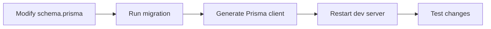

# Prisma Client Regeneration Issue

## Problem

After adding new fields to the Prisma schema, the Prisma client still showed the old types:

```
Unknown field `phoneIntegrationMethod` for select statement on model `Account`
```

## Root Cause

When you modify the Prisma schema (`schema.prisma`), you need to:
1. Run the database migration
2. **Regenerate the Prisma client**
3. Restart/rebuild the Next.js dev server

## Solution

### 1. Regenerate Prisma Client
```bash
cd packages/prisma
npx prisma generate
```

### 2. Trigger Next.js Rebuild
The dev server should automatically detect changes, but if it doesn't:

**Option A: Touch a file to trigger rebuild**
```bash
touch apps/frontend/apps/web/app/home/(user)/receptionist/setup/page.tsx
```

**Option B: Restart the dev server**
```bash
# Stop the dev server (Ctrl+C in terminal)
# Then restart it
./dev.sh
```

## When to Regenerate Prisma Client

You need to run `npx prisma generate` whenever you:
- ✅ Add new fields to models
- ✅ Add new models
- ✅ Change field types
- ✅ Add/remove relations
- ✅ Change field names (camelCase mapping)

## Verification

After regenerating, the Prisma client should recognize the new fields:

```typescript
// This should work now:
await prisma.account.findUnique({
  select: {
    phoneIntegrationMethod: true,  // ✅ Now recognized
    phoneIntegrationSettings: true, // ✅ Now recognized
  },
});
```

## Development Workflow



### Commands in Order
```bash
# 1. Edit schema.prisma
# 2. Apply migration
cd packages/prisma
psql $DATABASE_URL -c "ALTER TABLE accounts ADD COLUMN ..."

# 3. Generate Prisma client
npx prisma generate

# 4. Trigger rebuild (optional if dev server doesn't auto-reload)
touch apps/frontend/apps/web/app/home/(user)/receptionist/setup/page.tsx
```

## What Was Done

1. ✅ Modified `packages/prisma/schema.prisma` to add:
   ```prisma
   phoneIntegrationMethod   String? @default("none") @map("phone_integration_method")
   phoneIntegrationSettings Json?   @default("{}") @map("phone_integration_settings")
   ```

2. ✅ Applied database migration:
   ```sql
   ALTER TABLE accounts 
   ADD COLUMN phone_integration_method TEXT DEFAULT 'none',
   ADD COLUMN phone_integration_settings JSONB DEFAULT '{}';
   ```

3. ✅ Regenerated Prisma client:
   ```bash
   npx prisma generate
   ```

4. ✅ Triggered Next.js rebuild by touching the file

## Troubleshooting

### If error persists after regenerating:

**Check 1: Verify Prisma client location**
```bash
ls node_modules/.pnpm/@prisma+client*/node_modules/@prisma/client
```

**Check 2: Clear Next.js cache**
```bash
rm -rf apps/frontend/apps/web/.next
```

**Check 3: Restart dev server**
```bash
# Stop current server
# Then:
./dev.sh
```

**Check 4: Verify schema has correct mapping**
```prisma
model Account {
  // Make sure @map() matches database column name
  phoneIntegrationMethod String? @map("phone_integration_method")
}
```

## Common Mistakes

❌ **Forgot to regenerate after schema change**
```bash
# Edit schema.prisma
# Run migration
# ❌ Start using new fields immediately
# Result: Type errors
```

✅ **Correct workflow**
```bash
# Edit schema.prisma
# Run migration
# npx prisma generate  ← Don't forget this!
# Now use new fields
```

## Summary

After modifying the Prisma schema:
1. ✅ Run migration on database
2. ✅ Run `npx prisma generate` 
3. ✅ Restart/rebuild dev server
4. ✅ Test the changes

The Prisma client is now up to date with the new `phoneIntegrationMethod` and `phoneIntegrationSettings` fields! 🎉
